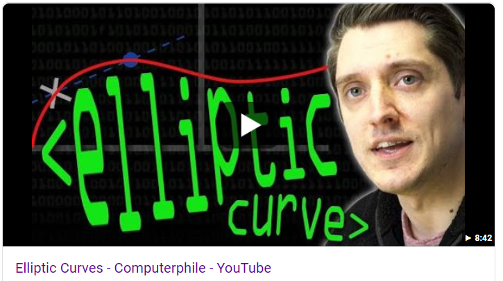

# Module 5 - Intermediate Lab: Elliptic Curve Cryptography 

## Background
Cryptocurrencies such as Bitcoin and Ethereum make use of an Elliptic Curve Digital Signing Algorithm (ECDSA). The use of cryptographic systems like this involves certification of some data (e.g. a transaction) by or authentication of the possessors of the private keys, and verification by the possessors of public keys. ECDSA is a different paradigm than that of the commonly used RSA-key cryptography. This lab will explore more about it. 

## Meta Information
| Attribute | Explanation |
| - | - |
| Summary | The lab will explore the concept of Elliptic Curve Cryptography from a video done by Computerphile on Youtube. |
| Topics | Elliptic Curve Crytography,  |
| Audience | CS1 and above |
| Difficulty | Beginner. |
| Strengths | Concept is learned from a comprehensive source, backed up by a test of retention. |
| Weaknesses | The mathematics of Elliptic Curve Cryptography might be intimidating, even if this lab keeps it to a minimum. |
| Dependencies | Internet connection, access to youtube.com |
| Variants | This format of lab may be used for RSA-key cryptography as well. |

## Assignment Instructions
1. Click on the video below and watch it. It may take several watches to understand Elliptic Curve Crytography. Special thanks to [Computerphile on Youtube](https://www.youtube.com/channel/UC9-y-6csu5WGm29I7JiwpnA) for creating amazing resources in Mathematics and Computer Science.

2. Answer the following questions:
* In simple terms, what is the Diffie-Hellman key exchange used for?
* An Elliptic Curve is just some set of numbers. (TRUE OR FALSE)
* In Elliptic Curve cryptography, there is a point called the Generator. This point is known by all parties. What is the Generator point in Bitcoin? (Use the internet! Here’s a hint: The curve that Bitcoin uses is called secp256k1)
* Does adding Generator points to each other make points on the graph look random? (TRUE OR FALSE)
* When adding Generator points together, is it possible to intersect more than one point? (TRUE OR FALSE)
* What is a private key in the context of Elliptic Curve Cryptography?
* If I have private key a and you have private key b, and we know the Generator point G, what is our shared secret?
* If you’re the owner of a huge datacenter that wishes to implement some type of cryptographic security, why would you bother with Elliptic Curve Cryptography?
* Is there only one curve? (TRUE OR FALSE)
    * If more than one, why would there be more?

3. If you are still interested in Elliptic Curve Cryptography, these are very interesting resources to look at:
    * https://safecurves.cr.yp.to - Repository of safe curves
## Credits
Dr. Debasis Bhattacharya  
Mario Canul  
Saxon Knight  
Computerphile on Youtube
